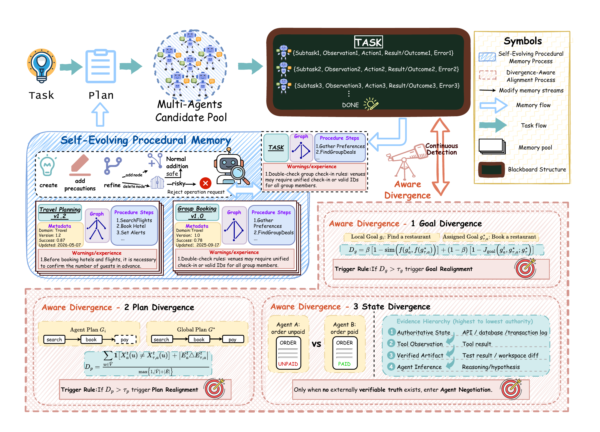
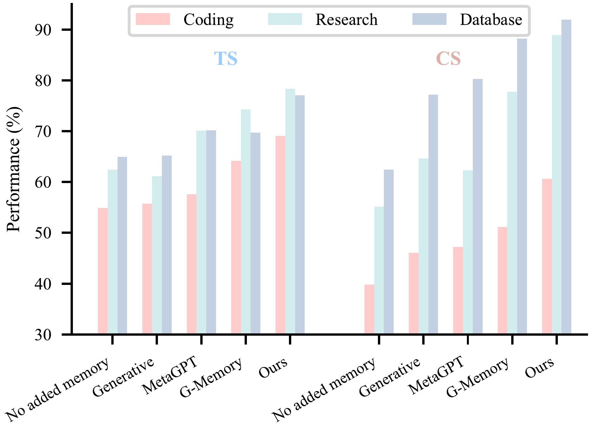
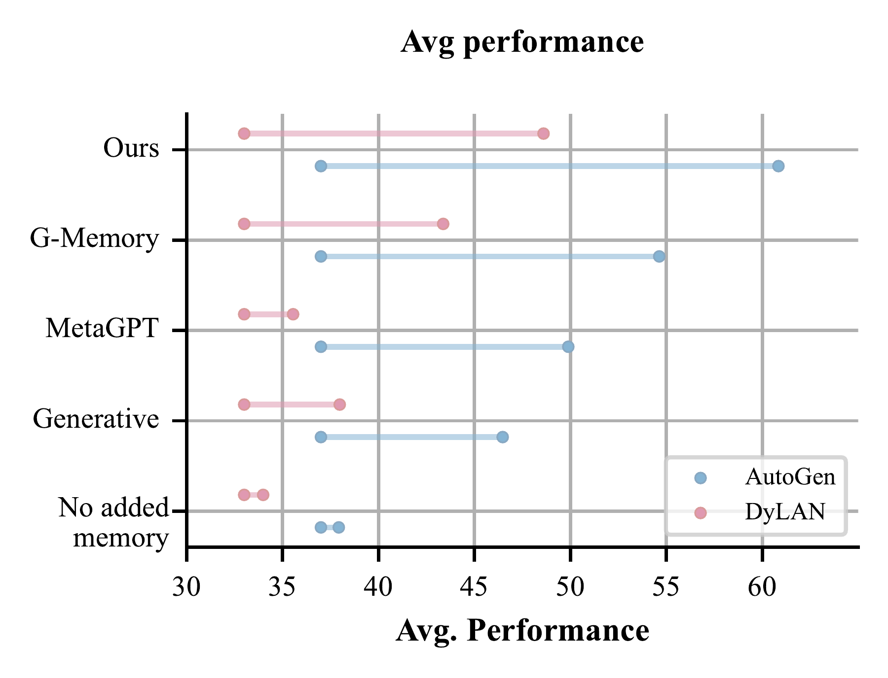
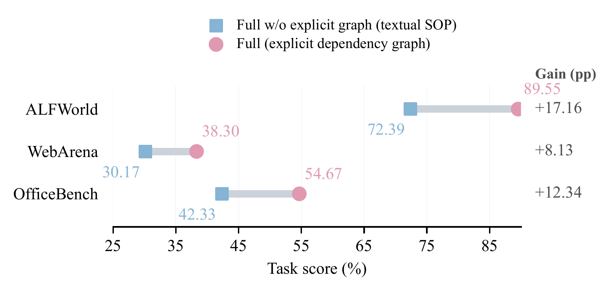
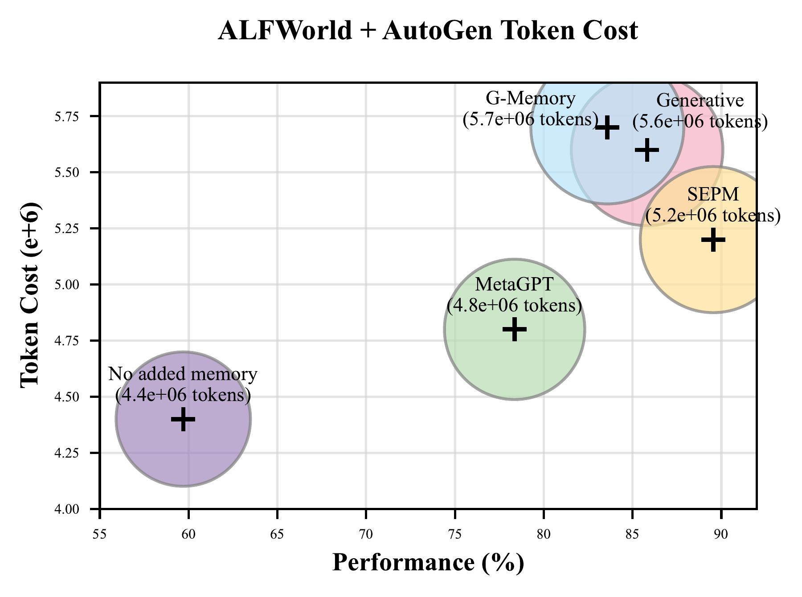
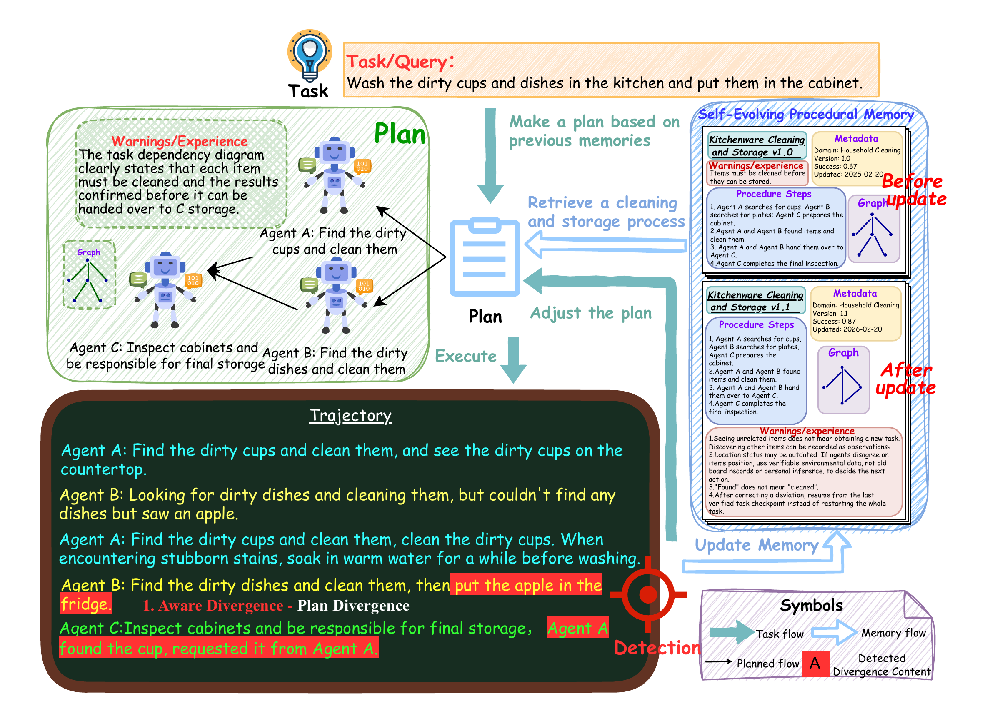

<h1 align="center">SEPM: Self-Evolving Procedural Memory Grounded in Task Graphs for Multi-Agent Collaboration</h1>

<!-- Replace the arXiv homepage with the paper's abstract URL when available. -->
<div align="center">
  <a href="https://arxiv.org/">
    
  </a>
  <a href="https://www.python.org/downloads/">
    
  </a>
  <a href="LICENSE">
    
  </a>
</div>

<h5 align="center">If you find our work helpful, please give us a star ⭐ on GitHub. We greatly appreciate your support.</h5>

---

## 📑 Contents

- [👀 Overview](#-overview)
- [✨ Main Results](#-main-results)
- [🔎 Case Study](#-case-study)
- [🔎 Case Study: Complete Workflow](#-case-study-complete-workflow)
- [📁 Project Structure](#-project-structure)
- [🚀 Quick Start](#-quick-start)
- [🧪 Evaluation](#-evaluation)
- [📄 Paper and License](#-paper-and-license)

---

## 👀 Overview

**In multi-agent work, memory and collaboration cannot be separated.** A remembered step is useful only when the team knows who should perform it, which other agents' outputs it depends on, and what evidence confirms that its prerequisites are satisfied. Sharing a procedure or assigning it to a role does not establish these conditions. When they are left implicit, agents may repeat work, act before a handoff is ready, or reuse a procedure after its assumptions have changed.

We propose **SEPM**, a complete memory-based collaboration framework that makes **task dependency graphs** the common representation for persistent memory and live execution. Nodes describe executable steps; directed edges record cross-agent prerequisites. A retrieved procedure becomes a task graph linked to agent assignments and verified state on a shared blackboard. The same edges then support prerequisite checks, plan comparison, and the propagation of corrections when an agent's goal, plan, or world-state view diverges.

The framework separates private agent context, a shared execution blackboard, and a persistent procedure pool, while the task graph connects them across the task lifecycle:

- **Store and evolve:** retain verified actions, dependency edges, applicability conditions, and conditional warnings from failures in versioned procedures; supported repairs refine a procedure or create a new one.
- **Retrieve and use:** bring relevant procedures into planning so a new team reuses both the steps and the coordination constraints that made them work.
- **Coordinate and verify:** link agent assignments and blackboard evidence to graph nodes, detect goal/plan/state divergence, and correct affected steps before their dependents proceed.

The memory that guides collaboration is therefore revised by evidence from that collaboration.

<p align="center">
  <br>
  <em>Framework overview (paper Figure 2). Retrieved procedures guide the task graph; blackboard evidence supports divergence-aware alignment and feeds verified revisions back into procedural memory.</em>
</p>

The framework diagram follows one full cycle: retrieve a reusable procedure, instantiate its dependencies for the current team, record execution against those dependencies, correct deviations, and update the procedure pool using verified outcomes. It shows why the graph serves both collaboration and memory evolution.

The paper evaluates whether this joint design improves the team's **task output and coordination quality**. Figure 1 reports both dimensions on MultiAgentBench before the more detailed benchmark and mechanism analyses below.

<p align="center">
  <br>
  <em>Paper Figure 1. Under AutoGen, SEPM has the highest Task Score (TS) and Communication Score (CS) in coding, research, and database tasks.</em>
</p>

The MultiAgentBench comparison spans **100 tasks in each environment**. TS measures task output; CS measures communication and planning. Both retain the benchmark's reporting scale. Figure 1 shows SEPM leading on both dimensions across the three environments; relative to G-Memory, its largest TS gain is on database tasks (**+7.30 points**) and its largest CS gain is on research tasks (**+11.14 points**).

### Key Contributions

1. **Coordination-native procedural memory.** Task dependency graphs represent both active collaborative plans and reusable procedures, so cross-agent prerequisites survive the transition from one task to the next.
2. **Evidence-grounded alignment.** A shared blackboard records structured execution evidence; goal, plan, and world-state divergence signals guide corrections while agents retain their private context.
3. **Self-evolving procedures.** Verified actions and dependencies can become graph-structured SOPs. Revisions, context-specific variants, and retirement are governed by validation, utility, safety, and version history.

The repository implements these ideas as an installable Python memory layer:

| Mechanism | Role in the workflow | Code |
| --- | --- | --- |
| Shared task graph and blackboard | Store assignments, prerequisites, observations, outcomes, errors, and evidence | [`models.py`](src/sepm/models.py), [`storage.py`](src/sepm/storage.py) |
| Divergence and realignment | Detect goal, plan, and state disagreements; resolve state claims by evidence priority | [`divergence.py`](src/sepm/divergence.py), [`evidence.py`](src/sepm/evidence.py) |
| Evolving procedures | Propose, validate, reproduce, and version graph-structured SOPs | [`service.py`](src/sepm/service.py), [`safety.py`](src/sepm/safety.py) |
| Contextual retrieval | Filter applicable SOPs and rank them with lexical and vector relevance | [`retrieval.py`](src/sepm/retrieval.py) |

This implementation map follows a procedure from storage and retrieval into execution, alignment, and revision. [`SEPMService`](src/sepm/service.py) connects the modules, while the [storage schema](docs/STORAGE_SCHEMA.md) documents the graph objects, blackboard events, and SQLite version history.

---

## ✨ Main Results

The figures and numbers in this section are **reported in the supplied SEPM manuscript**. [Evaluation](#-evaluation) explains the scope of the code and local experiment matrix in this workspace.

### Cross-benchmark task performance

The paper reports the highest task score for SEPM in all six benchmark–host settings. Under AutoGen, the gains over the same host without added memory are **+29.85 points** on ALFWorld, **+25.86** on WebArena, and **+13.00** on OfficeBench.

| Host | Memory | ALFWorld ↑ | WebArena ↑ | OfficeBench ↑ |
| --- | --- | ---: | ---: | ---: |
| AutoGen | No added memory | 59.70 | 12.44 | 41.67 |
| AutoGen | Generative Agents | 85.82 | 15.27 | 38.33 |
| AutoGen | MetaGPT | 78.36 | 25.99 | 45.33 |
| AutoGen | G-Memory | 83.58 | 30.30 | 50.00 |
| AutoGen | **SEPM** | **89.55** | **38.30** | **54.67** |
| DyLAN | No added memory | 53.73 | 14.90 | 33.33 |
| DyLAN | Generative Agents | 65.67 | 15.27 | 33.00 |
| DyLAN | MetaGPT | 49.25 | 22.41 | 35.00 |
| DyLAN | G-Memory | 61.94 | 25.49 | 42.67 |
| DyLAN | **SEPM** | **68.66** | **29.80** | **47.33** |

<sub>Paper Table 1. Task scores are percentages; bold marks the best observed score within each host and benchmark.</sub>

Table 1 shows that the strongest alternative changes with the environment: Generative Agents is strongest among the baselines on AutoGen ALFWorld, while G-Memory is strongest on AutoGen WebArena and OfficeBench. SEPM leads in each host–benchmark block, with gains over the strongest alternative of **3.73/8.00/4.67** points under AutoGen and **2.99/4.31/4.66** under DyLAN (ALFWorld/WebArena/OfficeBench).

The unweighted three-benchmark mean rises from **37.94% to 60.84%** under AutoGen and from **33.99% to 48.60%** under DyLAN. A textual-procedure control retains the step descriptions and prerequisites but replaces graph objects and adjacency relations with text. Explicit graphs improve its scores by **17.16**, **8.13**, and **12.34** points on ALFWorld, WebArena, and OfficeBench.

<table>
  <tr>
    <td width="50%" align="center" valign="top">
      <a href="docs/readme-assets/overall-performance.png"></a><br>
      <sub><strong>Paper Figure 4(a).</strong> Mean task score across the three benchmarks, by host.</sub>
    </td>
    <td width="50%" align="center" valign="top">
      <a href="docs/readme-assets/graph-vs-text.png"></a><br>
      <sub><strong>Paper Figure 5(a).</strong> Full SEPM versus the textual-procedure control.</sub>
    </td>
  </tr>
</table>

The left panel makes the improvement across both hosts visible in one view. The right panel tests the representation itself: retaining procedure text and prerequisites without explicit graph operations lowers performance on all three benchmarks. Together, the panels connect the overall gain to the paper's central design choice.

### Model sensitivity

Across the 13 reported configurations, task scores span **57.46–93.28%** on ALFWorld, **14.53–43.23%** on WebArena, and **45.67–67.67%** on OfficeBench. The task-execution and procedural-memory endpoints change together; the planning agent and goal-consistency judge stay fixed.

<details>
<summary><strong>Show all paper Table 2 scores</strong></summary>

Each row reports one joint task-execution and procedural-memory setting under AutoGen; `gpt-5-mini` is the main configuration used in Table 1.

| Model endpoint | ALFWorld ↑ | WebArena ↑ | OfficeBench ↑ |
| --- | ---: | ---: | ---: |
| qwen3.5-0.8b | 58.21 | 14.53 | 45.67 |
| qwen3.5-2b | 57.46 | 14.78 | 45.67 |
| qwen3.5-9b | 67.16 | 16.01 | 49.67 |
| qwen3.5-27b | 81.34 | 30.42 | 55.67 |
| gemma-4-12b-it | 72.39 | 22.54 | 53.00 |
| gemma-4-31b-it | 77.61 | 28.69 | 54.33 |
| deepseek-v4-flash-0731 | **93.28** | 38.05 | 64.33 |
| qwen3.8-max | 89.55 | 39.41 | 63.67 |
| glm-5.2 | 85.82 | 37.93 | 60.67 |
| kimi-k3 | 90.30 | 42.36 | 65.33 |
| gpt-5-mini (main) | 89.55 | 38.30 | 54.67 |
| gpt-5.6-terra | 91.79 | **43.23** | **67.67** |
| claude-opus-5 | 92.54 | 42.49 | 65.33 |

<sub>Paper Table 2. Task scores are percentages; bold marks the highest observed value in each column.</sub>

Table 2 shows that the best endpoint depends on the environment: `deepseek-v4-flash-0731` leads on ALFWorld, while `gpt-5.6-terra` leads on WebArena and OfficeBench. Because execution and memory management change together, the table describes sensitivity to their joint configuration.

</details>

### Component contributions

The shared blackboard is the foundation for both memory and alignment in this ablation. The full configuration leads on all three tasks; the individual gains differ by environment.

| AutoGen configuration | ALFWorld ↑ | WebArena ↑ | OfficeBench ↑ |
| --- | ---: | ---: | ---: |
| No added components | 59.70 | 12.44 | 41.67 |
| Blackboard only | 69.40 | 27.71 | 45.00 |
| Blackboard + memory | 86.57 | 33.99 | 45.33 |
| Blackboard + alignment | 82.09 | 34.48 | 51.00 |
| **Full SEPM** | **89.55** | **38.30** | **54.67** |

<sub>Paper Figure 5(b). Task scores are percentages. Memory includes cross-task procedure extraction, revision, and reuse; alignment detects and resolves divergence.</sub>

The component table separates the foundation from the two mechanisms built on it. The blackboard alone adds **9.70/15.27/3.33** points over no added components on ALFWorld/WebArena/OfficeBench. Adding memory to the blackboard contributes **17.17/6.28/0.33** more points; on OfficeBench, adding alignment after memory contributes **9.34** points. The full configuration is strongest in all three columns.

### Performance and token cost

On the 134 ALFWorld tasks under AutoGen, the paper reports **89.55%** success using **5.2 million** input and output tokens. Figure 4(b) pairs each method's complete-run task score with its total token use: no added memory uses 4.4M tokens at 59.70% success, Generative Agents uses 5.6M at 85.82%, and G-Memory uses 5.7M at 83.58%.

<p align="center">
  <br>
  <em>Paper Figure 4(b). Success and token totals refer to the same complete ALFWorld runs.</em>
</p>

Compared with no added memory, SEPM uses about **18.2%** more tokens and raises success by **29.85 points**. Compared with Generative Agents and G-Memory, it uses about **7.1%** and **8.8%** fewer tokens while improving success by **3.73** and **5.97** points, respectively. The plot therefore places SEPM's performance gain in the context of the computation spent to obtain it.

---

## 🔎 Case Study

The paper's cleaning-and-storage example shows how the task graph connects correction during execution to later procedural memory. Agent B encounters an apple and starts an unrelated action, triggering **plan realignment**. Agent C requests a cup before its cleaning has been verified, so the **cleaning-before-handoff prerequisite** blocks storage. After correction, the revised procedure retains the dependency and adds guidance for verifying state and resuming from a confirmed checkpoint.

<p align="center">
  <br>
  <em>Illustrative case (paper Figure 3). Different divergence signals lead to different corrections and a more precise reusable procedure.</em>
</p>

The illustration traces both corrections back into memory: the team returns to the assigned plan, checks the cleaning outcome before storage, and records these conditions for future tasks. It is an explanatory example of the proposed workflow, rather than an additional benchmark result.

---

## 🔎 Case Study: Complete Workflow

The same Figure 3 can be read as an end-to-end example of **retrieval → collaboration → realignment → memory revision**. The task is to wash dirty cups and dishes in a kitchen and put them in a cabinet.

<p align="center">
  <br>
  <em>Paper Figure 3, shown again for the full workflow. The upper path follows planning and execution; the lower path connects detected deviations to an updated procedure.</em>
</p>

1. **Retrieve a procedure and instantiate the task graph.** The team recalls *Kitchenware Cleaning and Storage v1.0*. Its steps assign cup cleaning, dish cleaning, and cabinet storage, while its graph and warning preserve the prerequisite that items must be cleaned before storage.
2. **Assign work with explicit dependencies.** Agent A finds and cleans cups, Agent B finds and cleans dishes, and Agent C inspects the cabinet and handles final storage. Cabinet inspection can run while A and B clean; handing an item to C depends on verified cleaning by its owner.
3. **Record execution evidence.** A reports finding cups and cleaning them. B cannot find dishes, notices an apple, and starts to put it in the refrigerator. C requests a cup after it has been found. Each agent's subtask, observation, action, outcome, and error are recorded against the shared task state.
4. **Detect two different deviations.** B's refrigerator action is outside the assigned dish-cleaning plan, so SEPM detects **plan divergence**. C's request exposes a **state/prerequisite issue**: finding a cup establishes its location, but does not prove it has been cleaned. The storage handoff cannot proceed from a location claim alone.
5. **Realign without discarding valid progress.** B returns to the dish-cleaning subtask; seeing the apple remains an observation rather than a new task. C may continue inspecting the cabinet, but waits for evidence of A's cleaning outcome before storage. The team resumes from its last verified checkpoint instead of restarting the entire workflow.
6. **Revise and reuse memory.** Verified actions and supported dependency edges inform *v1.1*. The revision retains cleaning-before-handoff and adds conditional guidance: unrelated items do not change the goal, disputed locations require verifiable environmental evidence, “found” is not “cleaned,” and corrected work resumes from a verified checkpoint. In the SEPM workflow, a proposed revision passes validation and promotion checks before entering the active procedure pool; later similar tasks can retrieve the revised graph and warnings.

This expanded reading makes the memory–collaboration loop explicit: the procedure constrains coordination, the blackboard supplies evidence for corrections, and those verified corrections change what the team can remember and reuse.

---

## 📁 Project Structure

```text
SEPM/
├── src/sepm/             # Core memory service, graphs, alignment, retrieval, storage
├── adapters/             # GMemory and cross-benchmark integration bridges
├── configs/              # Adapter and benchmark configuration
├── manifests/            # Selected case IDs for local experiment plans
├── scripts/              # Setup checks and staged experiment runner
├── examples/             # Small end-to-end Python example
├── tests/                # Core and integration-contract tests
├── docs/                 # Storage schema and README figure assets
├── evaluation_matrix.json
├── environment.yml       # Optional full Conda evaluation environment
└── pyproject.toml
```

Local `paper/`, `benchmark-results/`, `Evaluation/`, and `external/` directories are intentionally excluded from Git by [`.gitignore`](.gitignore). The PNGs in [`docs/readme-assets/`](docs/readme-assets/) are rendered from the supplied vector figures in `paper/image/` so that the README images display in a source checkout. Their [source mapping](docs/readme-assets/README.md) is recorded alongside the assets.

---

## 🚀 Quick Start

### 1. Install the core package

Python 3.10 or newer is required. From the repository root:

```bash
python -m venv .venv
# Activate .venv for your shell, then:
python -m pip install -e ".[dev]"
```

### 2. Run a complete local example

```bash
python examples/end_to_end.py
sepm --db sepm_demo.db candidates
sepm --db sepm_demo.db retrieve "verified catalog results"
```

The example registers an agent, creates workspaces, proposes and validates a procedure, records a successful trial, publishes a version, and retrieves it. It writes `sepm_demo.db` in the current directory.

### 3. Check the implementation

```bash
pytest -q
sepm-benchmark --output benchmark-results/mechanism/report.json
```

`sepm-benchmark` exercises deterministic divergence, evidence, promotion, and retrieval checks without an LLM service.

### Integrate with an agent system

`SEPMService` is the Python facade. [`AgentMemoryAdapter`](src/sepm/adapter.py) exposes agent-start, agent-step, and SOP-outcome hooks for host frameworks. The memory layer does not require changing the host's agent count or communication topology.

```python
from sepm.adapter import AgentMemoryAdapter
from sepm.service import SEPMService

adapter = AgentMemoryAdapter(SEPMService("sepm.db"))
context = adapter.on_agent_start(profile, workspace, task_query, query_plan)
step_result = adapter.on_agent_step(blackboard_entry)
adapter.on_sop_outcome(sop_id, success=True, query=task_query)
```

See [`examples/end_to_end.py`](examples/end_to_end.py) for concrete model objects and a runnable procedure lifecycle.

---

## 🧪 Evaluation

The checked-in [`evaluation_matrix.json`](evaluation_matrix.json), [`manifests/`](manifests/), and [`scripts/run_paper_experiments.sh`](scripts/run_paper_experiments.sh) define the **local selected-case evaluation workflow** and its adapters. Full runs need the upstream benchmark repositories under `external/`, benchmark-specific services, and model credentials. The current selected-case matrix and ignored local result files are **not the complete 134/812/300-task artifact set behind the manuscript's headline table**.

For the full dependency environment and a configured server:

```bash
conda env create -f environment.yml
conda activate sepm
cp .env.example .env          # Then fill in your own credentials and endpoints
python scripts/validate_paper_setup.py --require-jobs
bash scripts/run_paper_experiments.sh all
```

The runner has `preflight`, `smoke`, `matrices`, `generality`, `sop-models`, `ablation`, and `report` stages. It writes resumable results under `benchmark-results/`; [`scripts/validate_paper_setup.py`](scripts/validate_paper_setup.py) checks required jobs and external paths before a formal run. Use `python -m sepm.evaluation_runner --help` and `python -m sepm.ablation.runner --help` for matrix filters and individual stages.

---

## 📄 Paper and License

**Manuscript:** *SEPM: Self-Evolving Procedural Memory Grounded in Task Graphs for Multi-Agent Collaboration* (anonymous ICLR 2027 submission). The draft PDF is in `paper/SEPM.pdf` in this workspace; `paper/` is not part of the source release. Please use the public manuscript's bibliographic record when one becomes available.

This code is licensed under [Apache 2.0](LICENSE).
