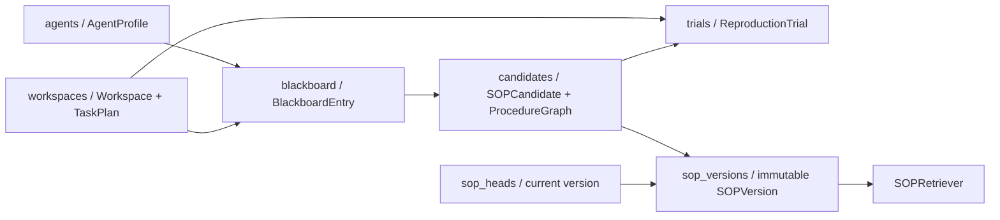

# 图结构与黑板存储结构

## 1. 结论

当前实现使用 **SQLite + JSON edge list**，不是图数据库。计划图和 SOP 图由 Pydantic 验证，
随后作为完整 JSON 快照写入 SQLite；高频筛选字段另外保存为关系列和索引。这样可以保留图结构，
同时支持事务、版本 CAS、分页和审计。

核心定义位置：

| 内容 | Python 模型 | SQLite 表/列 | 文件 |
|---|---|---|---|
| 任务计划图 | `TaskPlan(nodes, edges)` | `workspaces.workspace_json` | `src/team_memory/models.py`、`storage.py` |
| SOP 过程图 | `ProcedureGraph(steps, edges)` | `candidates.candidate_json`、`sop_versions.sop_json` | `models.py`、`storage.py` |
| 共享黑板 | `BlackboardEntry` | `blackboard` | `models.py`、`storage.py` |
| 当前 SOP head | `SOPVersion` | `sop_heads` 指向 `sop_versions` | `storage.py` |
| 图相似度 | `normalized_plan_distance` | 读取 JSON 后在 Python 中计算 | `divergence.py`、`retrieval.py` |

## 2. 图的内存结构

### 2.1 任务计划图

```json
{
  "nodes": [
    {"node_id": "search", "action": "search verified catalog"},
    {"node_id": "rank", "action": "rank verified candidates"}
  ],
  "edges": [
    {"source": "search", "target": "rank"}
  ]
}
```

`Workspace.plan` 保存任务的规范计划快照，并与 `main_goal`、`goal_version`、`plan_version`
一起序列化到 `workspaces.workspace_json`。边表示 `source → target` 的先后/依赖关系。

### 2.2 SOP 过程图

```json
{
  "steps": [
    {
      "step_id": "verify",
      "instruction": "Verify the artifact",
      "action_type": "verify",
      "preconditions": [],
      "postconditions": ["artifact.verified"],
      "requires_confirmation": false,
      "safety_critical": false
    }
  ],
  "edges": []
}
```

`ProcedureGraph` 在模型验证阶段检查每条边的端点是否存在。候选图存入
`candidates.candidate_json`；发布后，每个不可变版本存入 `sop_versions.sop_json`，
`sop_heads` 只维护当前活动版本指针。更新不会覆盖历史图。

## 3. 黑板的内存结构

`BlackboardEntry` 是追加式事件，不保存隐藏推理链。论文中的轻量执行记录只要求五个公开字段：

```text
{task, observation, action, result/outcome, error}
```

实现会在同一个事件对象中附加状态裁决和计划对齐所需的结构化元数据：

```text
entry_id, workspace_id, agent_id, kind,
task, observation, action, result, error,
state_key, state_value, goal, plan, evidence[], created_at
```

`kind` 可取 `task`、`observation`、`action`、`result`、`error`、`state_claim`、`plan`。
只有与当前事件有关的字段需要填写。例如工具观测写 `observation`，状态声明写
`state_key/state_value/evidence`。

## 4. 黑板的 SQLite 结构

```sql
CREATE TABLE blackboard (
    seq          INTEGER PRIMARY KEY AUTOINCREMENT,
    entry_id     TEXT UNIQUE NOT NULL,
    workspace_id TEXT NOT NULL,
    agent_id     TEXT NOT NULL,
    kind         TEXT NOT NULL,
    state_key    TEXT,
    entry_json   TEXT NOT NULL,
    created_at   TEXT NOT NULL
);

CREATE INDEX idx_blackboard_workspace_seq
    ON blackboard(workspace_id, seq);

CREATE INDEX idx_blackboard_state
    ON blackboard(workspace_id, state_key);
```

`seq` 给同一数据库内的事件提供稳定追加顺序；`entry_json` 保存完整事件；`workspace_id`、
`agent_id`、`kind`、`state_key` 单独展开，避免分页和状态冲突查询扫描全部 JSON。

黑板读取默认按 `seq DESC` 返回最新事件。完整方法按 workspace 共享；
`no-extra-components` 条件要求显式传入 `agent_id`，只返回该 Agent 的本地视图。

## 5. 实体关系



SQLite DDL 和所有读写方法位于 `src/team_memory/storage.py`；领域字段约束位于
`src/team_memory/models.py`；业务调用链位于 `src/team_memory/service.py`。
