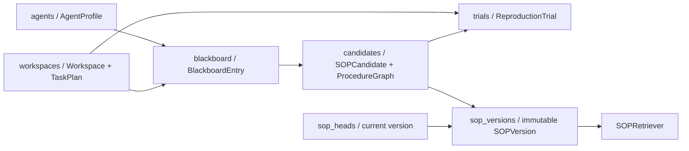

# Graph and Blackboard Storage Schema

## 1. Summary

The implementation uses **SQLite plus JSON edge lists**, not a graph database.
Pydantic validates task-plan and SOP graphs before complete JSON snapshots are
stored in SQLite. Frequently filtered fields are also represented as relational
columns and indexes. This design preserves graph structure while supporting
transactions, version compare-and-swap (CAS), pagination, and auditing.

Core definitions:

| Content | Python model | SQLite table/column | File |
|---|---|---|---|
| Task-plan graph | `TaskPlan(nodes, edges)` | `workspaces.workspace_json` | `src/sepm/models.py`, `storage.py` |
| SOP procedure graph | `ProcedureGraph(steps, edges)` | `candidates.candidate_json`, `sop_versions.sop_json` | `models.py`, `storage.py` |
| Shared blackboard | `BlackboardEntry` | `blackboard` | `models.py`, `storage.py` |
| Current SOP head | `SOPVersion` | `sop_heads` points to `sop_versions` | `storage.py` |
| Graph similarity | `normalized_plan_distance` | Computed in Python after loading JSON | `divergence.py`, `retrieval.py` |

## 2. In-Memory Graph Structures

### 2.1 Task-Plan Graph

```json
{
  "nodes": [
    {"node_id": "search", "action": "search verified catalog"},
    {"node_id": "rank", "action": "rank verified candidates"}
  ],
  "edges": [
    {"source": "search", "target": "rank"}
  ]
}
```

`Workspace.plan` stores the canonical task-plan snapshot. It is serialized to
`workspaces.workspace_json` together with `main_goal`, `goal_version`, and
`plan_version`. Each edge represents a `source -> target` ordering or dependency.

### 2.2 SOP Procedure Graph

```json
{
  "steps": [
    {
      "step_id": "verify",
      "instruction": "Verify the artifact",
      "action_type": "verify",
      "preconditions": [],
      "postconditions": ["artifact.verified"],
      "requires_confirmation": false,
      "safety_critical": false
    }
  ],
  "edges": []
}
```

`ProcedureGraph` verifies that every edge endpoint exists during model
validation. Candidate graphs are stored in `candidates.candidate_json`. After
publication, each immutable version is stored in `sop_versions.sop_json`, while
`sop_heads` maintains only the pointer to the active version. Updates never
overwrite historical graphs.

## 3. In-Memory Blackboard Structure

`BlackboardEntry` is an append-only event and does not store hidden reasoning.
The lightweight execution record used in the paper requires five public fields:

```text
{task, observation, action, result/outcome, error}
```

The implementation adds structured metadata for state resolution and plan
alignment to the same event object:

```text
entry_id, workspace_id, agent_id, kind,
task, observation, action, result, error,
state_key, state_value, goal, plan, evidence[], created_at
```

`kind` can be `task`, `observation`, `action`, `result`, `error`, `state_claim`,
or `plan`. Only fields relevant to the current event are populated. For example,
a tool observation sets `observation`, while a state claim sets
`state_key/state_value/evidence`.

## 4. SQLite Blackboard Schema

```sql
CREATE TABLE blackboard (
    seq          INTEGER PRIMARY KEY AUTOINCREMENT,
    entry_id     TEXT UNIQUE NOT NULL,
    workspace_id TEXT NOT NULL,
    agent_id     TEXT NOT NULL,
    kind         TEXT NOT NULL,
    state_key    TEXT,
    entry_json   TEXT NOT NULL,
    created_at   TEXT NOT NULL
);

CREATE INDEX idx_blackboard_workspace_seq
    ON blackboard(workspace_id, seq);

CREATE INDEX idx_blackboard_state
    ON blackboard(workspace_id, state_key);
```

`seq` provides a stable append order within one database, and `entry_json`
stores the complete event. `workspace_id`, `agent_id`, `kind`, and `state_key`
are separate columns so pagination and conflict queries do not scan every JSON
document.

Blackboard reads return the newest events by `seq DESC`. The full method shares
events within a workspace. The `no-extra-components` condition requires an
explicit `agent_id` and returns only that agent's local view.

## 5. Entity Relationships


```mermaid
flowchart LR
    Agent["agents / AgentProfile"] --> BB["blackboard / BlackboardEntry"]
    Workspace["workspaces / Workspace + TaskPlan"] --> BB
    Workspace --> Trial["trials / ReproductionTrial"]
    Candidate["candidates / SOPCandidate + ProcedureGraph"] --> Trial
    Candidate --> Version["sop_versions / immutable SOPVersion"]
    Head["sop_heads / current version"] --> Version
    BB --> Candidate
    Version --> Retrieval["SOPRetriever"]
```

SQLite DDL and all read/write methods live in `src/sepm/storage.py`. Domain
constraints live in `src/sepm/models.py`, and the business call chain lives in
`src/sepm/service.py`.
